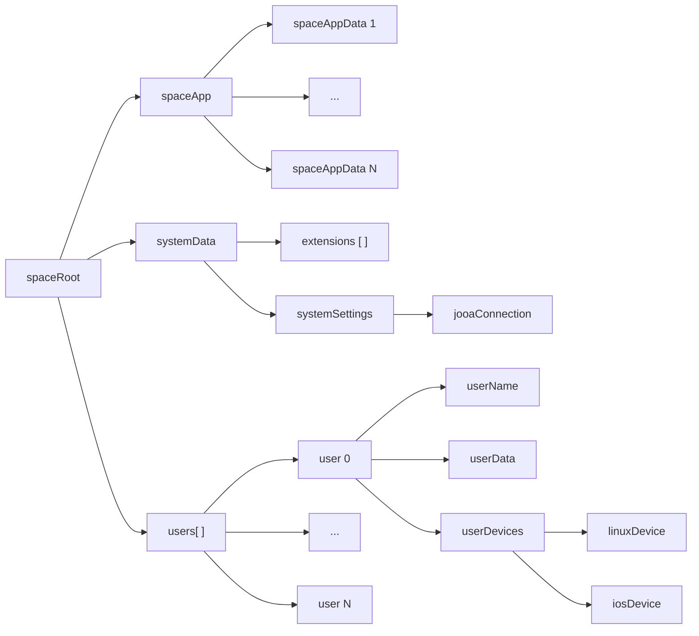

```mermaid
flowchart LR
spaceRoot --> spaceApp
spaceApp --> SpaceAppData1[spaceAppData 1]
spaceApp --> SpaceAppDatax[...]
spaceApp --> SpaceAppDataN[spaceAppData N]


spaceRoot --> systemData
systemData --> extensions["extensions [ ]"]
systemData --> systemSettings
systemSettings --> jooaConnection
spaceRoot --> users["users[ ]"]
users --> user0[user 0]
users --> userx[...]
users --> userN[user N]

user0 --> usr0username[userName]
user0 --> usr0userData[userData]
user0 --> usr0userDevices[userDevices]

usr0userDevices --> linuxDevice
usr0userDevices --> iosDevice
```